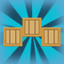
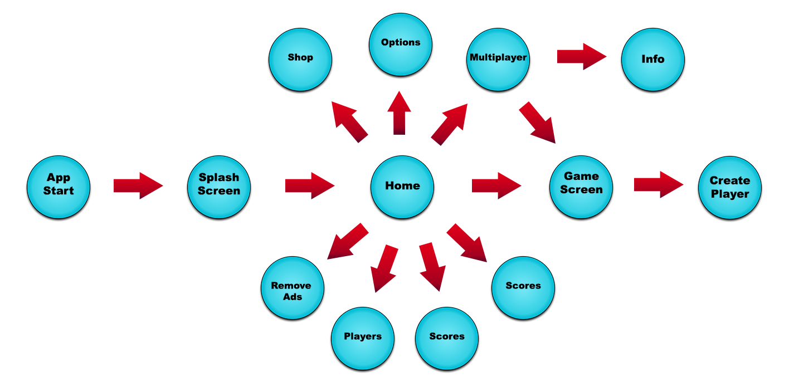
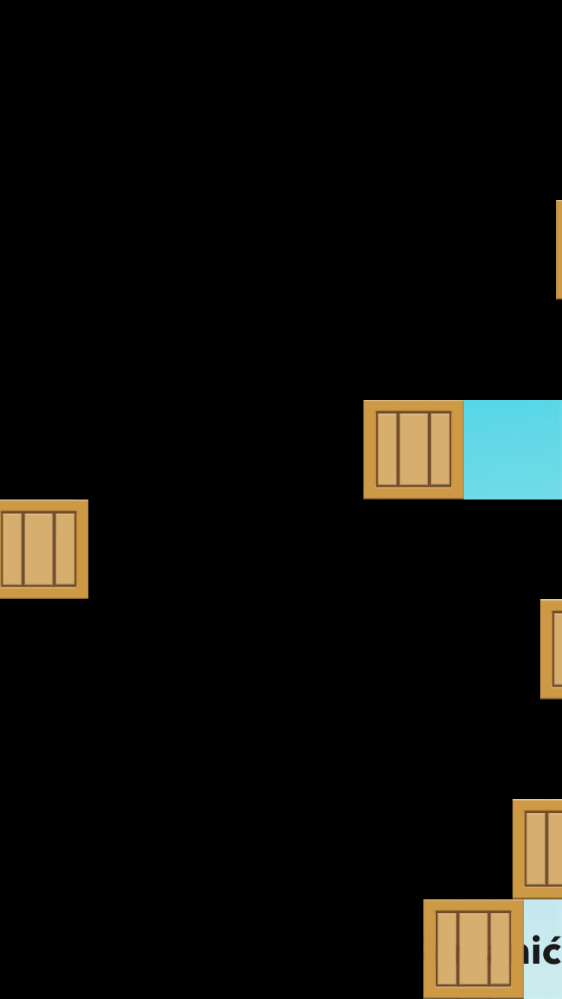
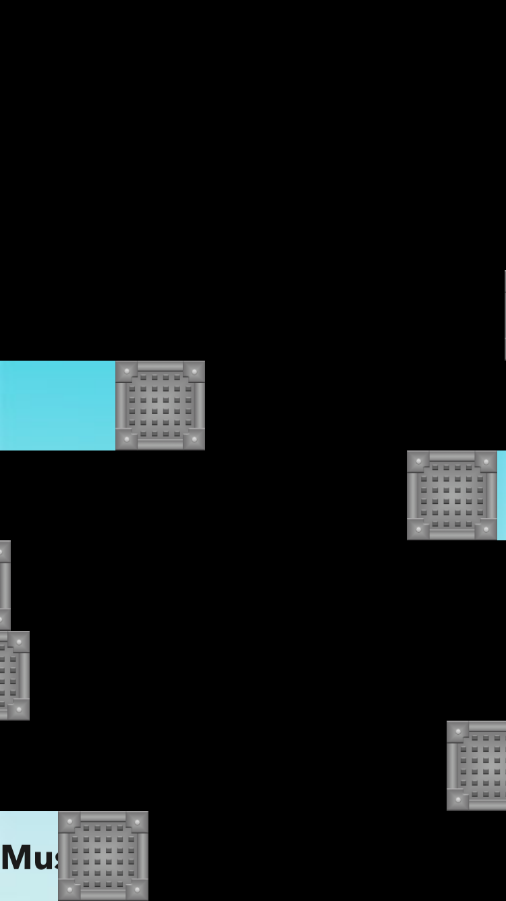
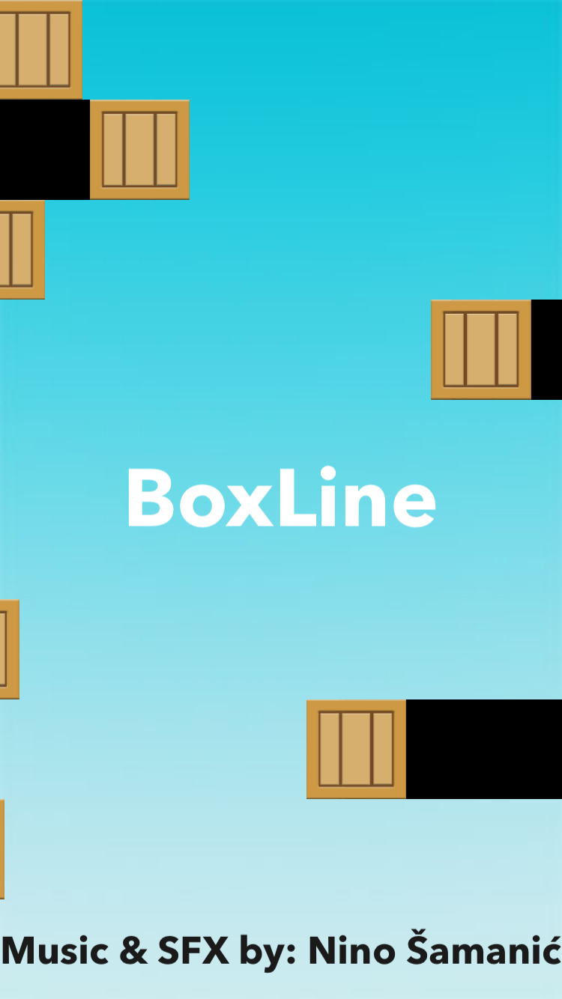

# Documentation: BoxLine
The game is based on player's reaction by using touch and tries to stop the box right within the wall. Depending on that precision the player gets rewards. By gaining more and more points the player is able to compete on local (country) and global (world) score list. Trough the game player has possibilities to unlock various achievements, to buy different players with various abilities, or to play in multiplayer where they can compete against other players on the server.

# Main Features
- Gameplay based on user reflex and precision
- Bunch of achievements in single and multiplayer mode waiting to be unlocked 
- List of players with all kinds of abilities in the shop
- Local (country) and global (World) competition trough the scores system
- Multiplayer mode for engaging player to set scores and to challenge each other with the random matchmaking system
- Unique UI with smooth animation for a great UX

# Workflow

  

 
## Splash Screen
The Splash Screen is the first thing shown after the user starts the application. It is separated into two views where the first one whose base text "loading boxes" representing the loading/preparing application. The second screen is cleaning the first one whit animated boxes revealing my associate which made Music and sound effects for this application. The animation animates for 10 sec where after that user navigates to the main screen named "Home". The animated boxes are representing currently selected box by the user, as it can be seen on the 3rd image.

    

