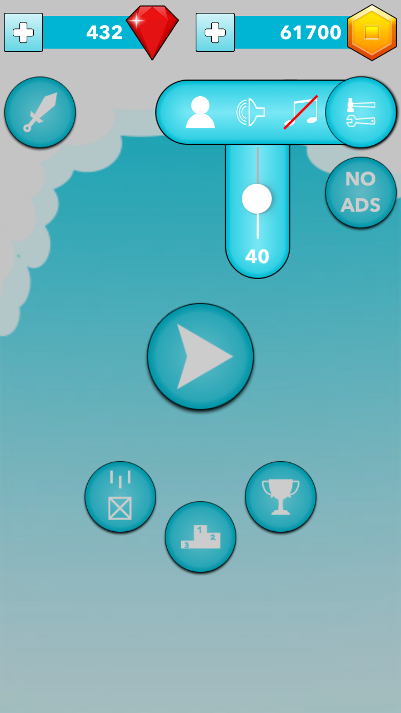

## Players Screen
While collecting coins and diamonds user can unlock various boxes for a new look and abilities. There are boxes which can be upgraded to upgrade its the base ability.

The boxes are divided into few groups: 
- base boxes 
- boxes with one ability
- boxes with more abilities.
  
  - base boxes
  
    When unlocking these boxes, the user gains a new look of he's box.

## Scores Screen
On this screen, the user can see his score competing on a local and global scale. Local-scale represents users country where global-scale represents all players around the world.

    

## Achievements Screen
During the application lifecycle, the user can unlock various achievements while in singleplayer, multiplayer or buying and upgrading various players. The achievements are segmented into two types: singleplayer and multiplayer. Every achievement is dived in three levels where each level brings more awards but on the other side, the tasks are getting much harder. If the user has any unlocked achievement the responding type will be glowing so he knows where to navigate and collect his prize.

      

## Options Screen
To update current user name, music or SFX strength the user can navigate to "Options" screen which is a part of "Home" screen.

     

## Shop Screen
If the user needs extra diamonds or coins he can navigate to "Shop" screen. The Shop is divided into three segments: special offer where he can once in 1h watch Ads to gain diamonds, buy diamonds for the defined price or convert diamonds into coins.

    

## Remove Ads
During playing the game every now and then Ads are shown to the player, to remove them / restore there is a button on "Home" screen. 

  

