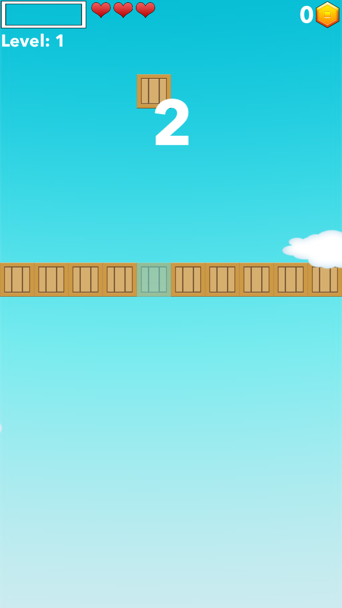

# BoxLine: Documentation
The game is based on player's reaction by using touch and tries to stop the box right within the wall. Depending on that precision the player gets rewards. By gaining more and more points the player is able to compete on local (country) and global (world) score list. Trough the game player has possibilities to unlock various achievements, to buy different players with various abilities, or to play in multiplayer where they can compete against other players on the server.

Main Features:
- Gameplay based on user reflex and precision
- Bunch of achievements in single and multiplayer mode waiting to be unlocked 
- List of players with all kinds of abilities in the shop
- Local (country) and global (World) competition trough the scores system
- Multiplayer mode for engaging player to set scores and to challenge each other with the random matchmaking system
- Unique UI with smooth animation for a great UX

# Workflow

  

 
## Splash Screen
The Splash Screen is the first thing shown after the user starts the application. It is separated into two views where the first one whose base text "loading boxes" representing the loading/preparing application. The second screen is cleaning the first one whit animated boxes revealing my associate which made Music and sound effects for this application. The animation animates for 10 sec where after that user navigates to the main screen named "Home". The animated boxes are representing currently selected box by the user, as it can be seen on the 3rd image.

    
 
 ## Home Screen
After splash screen user is navigated to the main screen "Home". The background is animated all-time with moving selected box behind the clouds. When switching between singleplayer and multiplayer all buttons are animated and switched for the selected mode.

From here we can navigate to screens:
- Game, 
- Multiplayer,
- Players, 
- Scores, 
- Achievements, 
- Options, 
- Shop 
- Remove Ads

      
 
## Game Screen
This screen shows the game of this application. User can enter this screen from "Home" or "Multiplayer". The main goal is to try to stop your box inside the wall. While stopping inside the wall, the coin bar is fulled. When hitting inside the wall repeatedly in a row, after 4 hits user starts collecting coins. As time goes and the user gains more coins the level is increased and therefore is the speed of box and even the precision for stopping in the wall to gain coins is much smalle. You can bounce from the wall a few times but after that, on the opposite wall, an obstacle (bomb) will show and if you hit it you lose one life. After you lose all lives, the end screen is shown where you have three decisions to make: home, restart or gain on extra life with watching Ads or using diamonds. On this screen, you can see if extra achievements are unlocked, made a new high score or share your current score. When in first time run during the game, at the end of game user gains the ability to register his name. The name isn't permanent and can be changed inside options.

             
 
 ## Multiplayer Screen
While picking multiplayer mode on "Home" screen, the user can pick which arena type he is interested. Arenas are working by using a specific amount of coins and trying to nearly double it. User can set three scores and wait for other players to match with one of his scores and try to win or lose. On the bottom, there is a "Find match" button which will look for available scores which you can try to win. 

          

## Players Screen
While collecting coins and diamonds user can unlock various boxes for a new look and abilities. There are boxes which can be upgraded to upgrade its the base ability.

The boxes are divided into few groups: 
- base boxes 
- boxes with one ability
- boxes with two ability
- boxes with three ability  
  
  ### Base boxes
  
    When unlocking these boxes, the user gains a new look of he's box.
    
        
     
  ### Boxes with one ability
    These boxes are divided in 5 gropus: 
    - Shielder, bounces from obstacles where each level of box gains one to three shields
    
            
         
    - Golder, increases the number of coins gain throughout the game, the multiplayer is increased by every level going from two to four
    
            

    - Sizer, increases the size of box, going from 5% to 15%
    
            
         
    - Leveler, lowers the speed of increase level (currently every 5 coins), going from 1 to 3 (8 coins)
    
            
         
    - Speeder, decreases the speed of box, going from 5% to 15%
    
            

  ### Boxes with two ability
    Divided into three groups: 
    - Darth Blue, coins multiplayer x2 & level speed -5% 
    - Meliva, size +5% and speed -5%  
    - Plexy, shield x1, coins x2

        
      
  ### Boxes with three ability
    This is the ultimate box with three abilities:
    - Clumsy, shields x2, coins x3, size +10%
    
    
    
     

## Scores Screen
On this screen, the user can see his score competing on a local and global scale. Local-scale represents users country where global-scale represents all players around the world.

    

## Achievements Screen
During the application lifecycle, the user can unlock various achievements while in singleplayer, multiplayer or buying and upgrading various players. The achievements are segmented into two types: singleplayer and multiplayer. Every achievement is dived in three levels where each level brings more awards but on the other side, the tasks are getting much harder. If the user has any unlocked achievement the responding type will be glowing so he knows where to navigate and collect his prize.

      

## Options Screen
To update current user name, music or SFX strength the user can navigate to "Options" screen which is a part of "Home" screen.

     

## Shop Screen
If the user needs extra diamonds or coins he can navigate to "Shop" screen. The Shop is divided into three segments: special offer where he can once in 1h watch Ads to gain diamonds, buy diamonds for the defined price or convert diamonds into coins.

    

## Remove Ads
During playing the game every now and then Ads are shown to the player, to remove them / restore there is a button on "Home" screen. 

  
