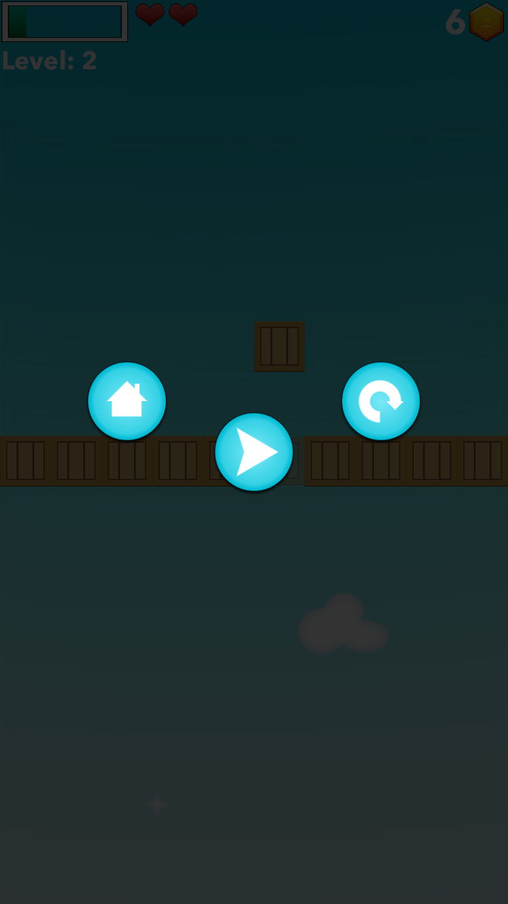

# Documentation: BoxLine
The game is based on player's reaction by using touch and tries to stop the box right within the wall. Depending on that precision the player gets rewards. By gaining more and more points the player is able to compete on local (country) and global (world) score list. Trough the game player has possibilities to unlock various achievements, to buy different players with various abilities, or to play in multiplayer where they can compete against other players on the server.

Main Features:
- Gameplay based on user reflex and precision
- Bunch of achievements in single and multiplayer mode waiting to be unlocked 
- List of players with all kinds of abilities in the shop
- Local (country) and global (World) competition trough the scores system
- Multiplayer mode for engaging player to set scores and to challenge each other with the random matchmaking system
- Unique UI with smooth animation for a great UX

# Workflow

  

 
## Splash Screen
The Splash Screen is the first thing shown after the user starts the application. It is separated into two views where the first one whose base text "loading boxes" representing the loading/preparing application. The second screen is cleaning the first one whit animated boxes revealing my associate which made Music and sound effects for this application. The animation animates for 10 sec where after that user navigates to the main screen named "Home". The animated boxes are representing currently selected box by the user, as it can be seen on the 3rd image.

    
 
 ## Home Screen
After splash screen user is navigated to the main screen "Home". The background is animated all-time with moving selected box behind the clouds. When switching between singleplayer and multiplayer all buttons are animated and switched for the selected mode.

From here we can navigate to:
- Game screen, 
- Players, 
- Scores, 
- Achievements, 
- Options, 
- Multiplayer
- Shop 
- Remove Ads

      
 
## Game screen
This screen shows the game of this application. User can enter this screen from "Home" or "Multiplayer". The main goal is to try to stop your box inside the wall. While stopping inside the wall, the coin bar is fulled. When hitting inside the wall repeatedly in a row, after 4 hits user starts collecting coins. As time goes and the user gains more coins the level is increased and therefore is the speed of box and even the precision for stopping in the wall to gain coins is much smalle. You can bounce from the wall a few times but after that, on the opposite wall, an obstacle (bomb) will show and if you hit it you lose one life. After you lose all lives, the end screen is shown where you have three decisions to make: home, restart or gain on extra life with watching Ads or using diamonds. On this screen, you can see if extra achievements are unlocked, made a new high score or share your current score. When in first time run during the game, at the end of game user gains the ability to register his name. The name isn't permanent and can be changed inside options.

              

