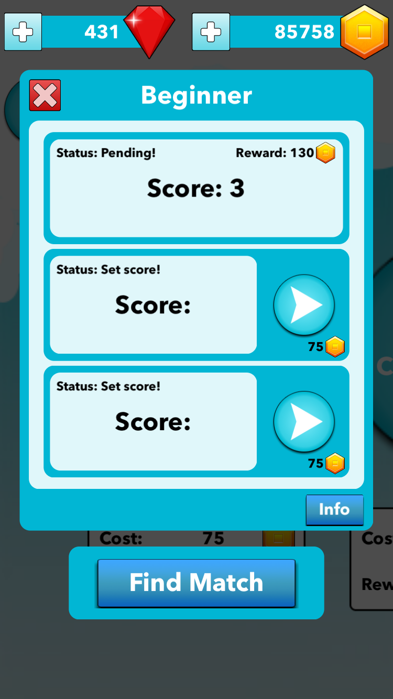
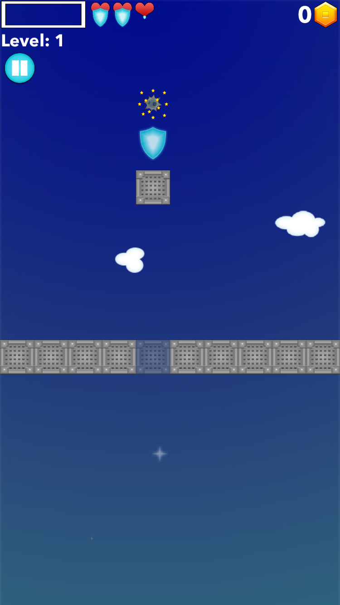

# BoxLine: Documentation
The game is based on the player's reaction to touch the screen and place the box inside a straight line of the wall. Through achieving more and more points, the player gets a possibility to compete on the local (national) and global (world) level, which becomes visible on the score lists. Throughout the game, the player has several options; unlocking various achievements, buying various players with differing abilities, or playing multiplayer where they can compete with other players on the server.

To see the application in live on App Store click: [Download](https://apps.apple.com/us/app/boxline/id1308313538?ls=1)

Main Features:
- The game is based on the reflex and precision of the user
- A bunch of achievements in single and multiplayer mode waiting to be unlocked 
- List of players with all kinds of abilities in the shop
- Local (national) and global (world) competition trough the scores system
- Multiplayer mode for engaging player to set the scores and challenge each other with the random matchmaking system
- Unique UI with smooth animation for a great UX

# Workflow

  

 
## Splash Screen
The splash screen is the first thing displayed after the user launches the application. It is divided into two views where the first, the basic text of which is the "loading boxes", is a loading/ preparing application. The second screen is a cleaning of the first one with animated boxes, which reveals my co-worker who made music and sound effects for the app. The animation lasts for 10 seconds, whereupon the user comes to the main screen named "Home". The animated boxes represent currently selected box by the user, as can be seen on the 3rd image below this text.

    
 
 
 ## Home Screen
After the splash screen, the user is navigated to the main "Home" screen. The background is animated all the time by moving the selected box behind the clouds. When switching between singleplayer and multiplayer, the UI is updatet to represent the selected mode.

From this point, we can navigate to several screens:
- Game
- Multiplayer
- Players
- Scores 
- Achievements 
- Options 
- Shop 
- Remove Ads

      
 
 
## Game Screen
This screen shows the game of this application. User can enter this screen from "Home" or "Multiplayer". The main goal is to try to stop your box inside the wall. When hitting inside the wall repeatedly in a row, after 4 hits user starts collecting coins. As time goes by and the user gets more coins, the level increases as the speed of the box increases and it becomes more and more difficult to place it accurately in the wall and get coins. It is possible to bounce off the wall several times, however, afterwards, a bomb is shown on the opposite wall as an obstacle, and hitting it means to lose one life. After losing all lives, an end screen will open, with three options: home, restart, or getting extra life by watching ads or using diamonds. On this screen, it can be seen if extra achievements are unlocked, whether the player made a new high score or the player can share their current score. At the end of the first game played, a user is given the opportunity to register their name. The name does not have to be permanent and can be changed in options.

             
 
 
 ## Multiplayer Screen
While selecting a multiplayer mode on the "Home" screen, the user can select the type of arena of their interest. The arenas work by using a certain amount of coins and trying to almost double it. The user can set up three scores and wait for other players to match one of his scores and try to win or lose. At the bottom, there is a "Find a match" button that will search for available results that you can try to win.

          

## Players Screen
While collecting coins and diamonds, the user can unlock various boxes for new looks and abilities. There are boxes which can be upgraded from their base ability.

The boxes are divided into a few groups: 
- base boxes 
- boxes with one ability
- boxes with two abilities
- boxes with three abilities  
  
  ### Base boxes
  
    When unlocking these boxes, the user gains a new look of their box.
    
        
     
  ### Boxes with one ability
    These boxes are divided in 5 groups: 
    - Shielder - bounces off obstacles where each level of the box gains one to three shields
    
            
         
    - Golder - increases the number of coins gained throughout the game, the multiplayer is increased by each level going from two to four
    
            

    - Sizer - increases the size of box, going from 5% to 15%
    
            
         
    - Leveler - lowers the speed of increased level (currently every 5 coins), going from 1 to 3 (8 coins)
    
            
         
    - Speeder - decreases the speed of box, going from 5% to 15%
    
            

  ### Boxes with two abilities
    Divided into three groups: 
    - Darth Blue, coins multiplayer x2 & level speed -5% 
    - Meliva, size +5% and speed -5%  
    - Plexy, shield x1, coins x2

        
      
  ### Boxes with three abilities
    This is the ultimate box with three abilities:
    - Clumsy, shields x2, coins x3, size +10%
    
    
    
     

## Scores Screen
From this screen, the user can see their score on a local and global scale. Local-scale represents users country, whereas global-scale represents players from all around the world.

    

## Achievements Screen
During the app lifecycle, the user can unlock various achievements while in singleplayer, multiplayer or buying and upgrading various players. The achievements are segmented into two types: singleplayer and multiplayer. Every achievement is divided into three levels where each level brings more rewards, but on the other side, the tasks are getting much more difficult. If the user has any unlocked achievement, the response type will be glowing so that the user knows where to go and collect their reward.

      

## Options Screen
To update current user name, music or SFX strength the user can navigate to "Options" screen which is a part of "Home" screen.

     

## Shop Screen
If the user needs extra diamonds or coins, they can navigate to "Shop" screen. The Shop is divided into three segments: a special offer where they can watch ads to get diamonds once in 1h, buy diamonds at a defined price, or convert diamonds into coins.

    

## Remove Ads
While playing the game, ads appear to the player from time to time. There is a button on the “Home” screen to remove/restore them.

  
